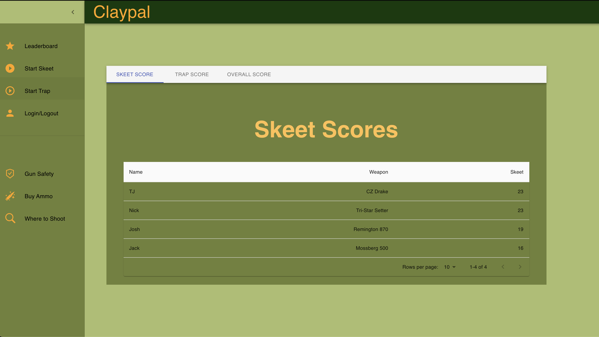

# ClayPal

[ClayPal Deployed]()

ClayPal is a score tracker for skeet and trap shooters. Using this makes keeping scores and stations organized, eaisily accessable and will keep the competitive drive between other users and yourself flowing with a leaderboard that shows all relevant stats.

Challenges that were overcame were capturing data to display to each card accurately and individually between stations, targets hit and the users that the stats apply to.

Using this Full Stack application, a user can interact with our ClayPal application to:

- `Create an account`
- `Login or logout of the application`
- `Add a skeet and trap score`
- `Browse your dashbaord to see a trend in your previous scores`
- `Browse the leaderboards to see where you rank against others`
- `Make sure to click the links to ensure gun safety measures`

# Table of Contents

- [Installation](#installation)
- [Technologies](#technologies)
- [License](#license)
- [Contributors](#contributors)
- [Test](#tests)
- [Questions](#questions)

# Installation

No installation necessary, visit our website here:
[ClayPal]()

# Technologies

A list of technologies used within the project:

- [Javascript](https://www.javascript.com/)
- [HTML](https://html.com/)
- [MaterialUI](https://material-ui.com/)
- [Express.js](https://expressjs.com/)
- [Node.js](https://nodejs.org/en/)
- [GraphQL](https://graphql.org/)
- [MongoDB](https://www.mongodb.com/)

# License

None at this time.

# Contributors

- [TJ Courey](https://github.com/TJCourey)
- [Nick Strong](https://github.com/strong-one)
- [Jack Neuner](https://github.com/jneuner21)
- [Josh Brown](https://github.com/Brownies-SE)

# Questions

If you have any questions feel free to contact me and fellow contributors at:

- tjcourey84@gmail.com
- nstrong92@yahoo.com
- Jneuner2165@gmail.com
- brownjoshalan@gmail.com
